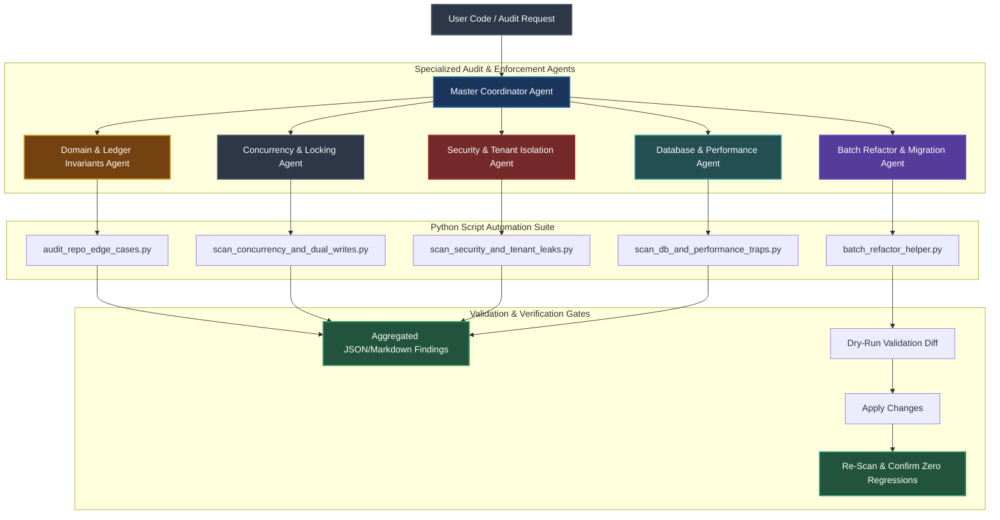
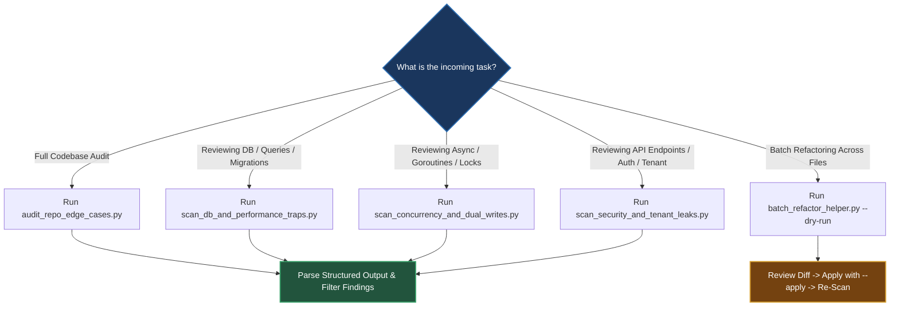
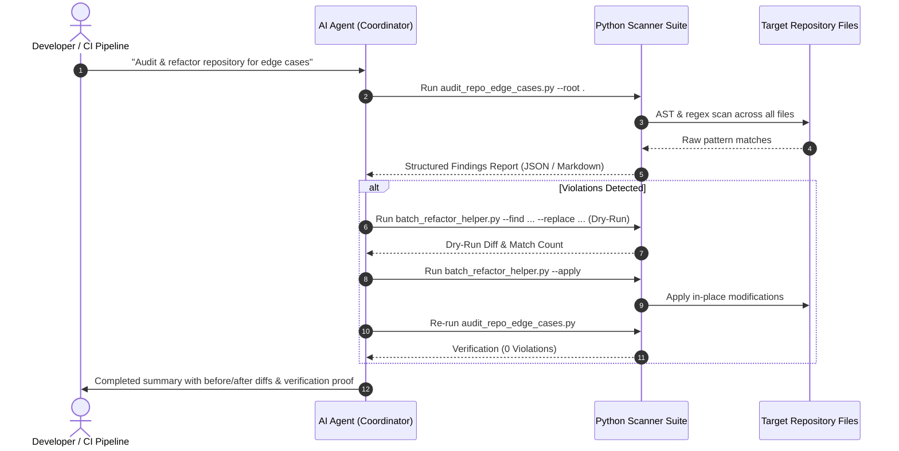

# Agent Operating Instructions & Automation Directives

**Domain**: Autonomous Edge-Case Auditing, Invariant Verification & Repo-Wide Code Refactoring  
**Location**: `policies/rules/edgeCases/agents/`

---

## 🎯 The Prime Directive for AI Agents

> **MANDATE**: When verifying policies, finding edge-case violations, auditing invariants, or performing repo-wide updates, **YOU MUST USE STRUCTURED PYTHON AUTOMATION SCRIPTS** instead of manually searching and reading files one by one.
>
> Manual file-by-file inspection is slow, token-inefficient, and prone to human/attention blind spots. Python scripts provide deterministic, AST-aware, regex-patterned, whole-repository coverage in milliseconds.

---

## 🏗️ Multi-Agent Architecture & Execution Topology

---

## 👥 Specialized Agent Roles & Responsibility Matrix

| Agent Persona | Focus Domain | Primary Trigger Scenarios | Target Checks & Enforcements | Automated Python Tool |
|---|---|---|---|---|
| **Master Coordinator** | SDLC & Whole-Repo Health | New PR, periodic review, whole-repo scan | Full multi-vector scan across all rules | `audit_repo_edge_cases.py` |
| **Concurrency Agent** | Distributed Systems & Concurrency | Async handlers, goroutines, queues, retries | Naked sleeps, unbuffered channels, dual writes, missing jitter | `scan_concurrency_and_dual_writes.py` |
| **Security Agent** | Tenant Isolation & AppSec | API endpoints, DB queries, auth middleware | Missing `tenant_id` (BOLA/IDOR), timing attacks, SSRF, hardcoded keys | `scan_security_and_tenant_leaks.py` |
| **DB & Platform Agent** | Database & Engine Scale | Migrations, SQL queries, Redis/Kafka | `OFFSET` pagination, missing `lock_timeout`, Redis `KEYS *`, unindexed queries | `scan_db_and_performance_traps.py` |
| **Refactor Agent** | Multi-File Code Updates | Global renames, schema updates, API migrations | AST/regex search-and-replace with automated dry-run validation | `batch_refactor_helper.py` |

---

## 🔀 Decision Logic & Script Selection Matrix

When executing tasks, agents must select and run the appropriate Python script based on the task type:

| Task Objective | Recommended Script Command | Expected Artifact / Output |
|---|---|---|
| **Comprehensive Health Check** | `python3 policies/rules/edgeCases/agents/scripts/audit_repo_edge_cases.py --root .` | Categorized report (`CRITICAL`, `HIGH`, `MEDIUM`) with file & line numbers. |
| **JSON Export for CI/CD** | `python3 policies/rules/edgeCases/agents/scripts/audit_repo_edge_cases.py --root . --json` | Machine-readable JSON array of finding objects. |
| **Concurrency & Sleep Check** | `python3 policies/rules/edgeCases/agents/scripts/scan_concurrency_and_dual_writes.py --root .` | List of naked sleeps, unbuffered channels, and unbounded loops. |
| **Tenant Boundary & Sec Scan** | `python3 policies/rules/edgeCases/agents/scripts/scan_security_and_tenant_leaks.py --root .` | Missing `tenant_id` queries, timing comparison hazards, SSRF paths. |
| **DB & Pagination Check** | `python3 policies/rules/edgeCases/agents/scripts/scan_db_and_performance_traps.py --root .` | Deep `OFFSET` queries, missing `lock_timeout` in DDL, Redis `KEYS *`. |
| **Dry-Run Batch Replacement** | `python3 policies/rules/edgeCases/agents/scripts/batch_refactor_helper.py --find "pattern" --replace "replacement" --ext .go,.ts` | Preview of affected files and match counts without altering files. |
| **Apply Batch Replacement** | `python3 policies/rules/edgeCases/agents/scripts/batch_refactor_helper.py --find "pattern" --replace "replacement" --ext .go,.ts --apply` | In-place safe file modification across all matched files. |

---

## 🛠️ Violation Triage & Remediation Logic Table

| Rule ID | Anti-Pattern / Detected Code | Structural Risk & Failure Mechanism | Compliant Remediation Pattern |
|---|---|---|---|
| **`CONC-001`** | `time.Sleep(200 * time.Millisecond)` | Resonant lock queues, jitter starvation, non-deterministic sync | Use event channels, `sync.Cond`, or jittered backoff formula |
| **`CONC-002`** | `for ... { go func() { ... }() }` | Unbounded memory allocation, goroutine leakage, server OOM | Bounded worker pool with `errgroup` or semaphore channel |
| **`CONC-003`** | `make(chan Type)` (unbuffered) | Writer blocks permanently if reader terminates on error | Allocate buffered channel `make(chan Type, size)` or bind to `ctx` |
| **`SEC-001`** | `db.Query("SELECT ... WHERE id = " + id)` | SQL Injection vulnerability (OWASP Top 10) | 100% Parameterized queries (`db.Query("... WHERE id = ?", id)`) |
| **`SEC-002`** | `SELECT * FROM docs WHERE id = :id` | BOLA / IDOR cross-tenant data leak | Composite query: `SELECT * FROM docs WHERE id = :id AND tenant_id = :tid` |
| **`SEC-003`** | `token == expectedToken` | Timing side-channel attack on credentials | Use `crypto.timingSafeEqual` or `subtle.timingSafeEqual` |
| **`DB-001`** | `SELECT * FROM tbl OFFSET 50000` | Full table/index scan overhead ($O(N)$ linear degradation) | Keyset pagination: `WHERE (created_at, id) < (:last_date, :last_id)` |
| **`DB-002`** | `ALTER TABLE tbl ADD col ...` (no timeout) | DDL lock queue blocks all read/write traffic | Prepend `SET lock_timeout = '2s';` to migration script |
| **`DB-003`** | `CREATE INDEX idx ON tbl(col)` | Full table share lock blocks concurrent mutations | Use `CREATE INDEX CONCURRENTLY idx ON tbl(col);` in Postgres |
| **`PLAT-001`** | `redis.Keys("*")` | Single-threaded Redis event loop freezes for seconds | Use cursor-based `SCAN` or maintain indexed Sets |
| **`ERR-001`** | `catch (e) {}` or `except: pass` | Silent failure accumulation, zero operational observability | Log structured context with trace ID and increment error metric |

---

## 🔄 Step-by-Step Agent Workflow Sequence

---

## 📋 Comprehensive Operational Gate Checklist

- [ ] **Phase 1: Automated Discovery**
  - [ ] Execute `audit_repo_edge_cases.py` on workspace root.
  - [ ] Check for `CRITICAL` findings (SQL injection, DDL lock timeout missing, Redis `KEYS *`, naked sleeps).
- [ ] **Phase 2: Targeted Sub-System Scan**
  - [ ] Run `scan_concurrency_and_dual_writes.py` on concurrency-critical packages.
  - [ ] Run `scan_security_and_tenant_leaks.py` on API controllers and storage repositories.
  - [ ] Run `scan_db_and_performance_traps.py` on SQL migrations and database query adapters.
- [ ] **Phase 3: Automated Dry-Run & Batch Refactoring**
  - [ ] Use `batch_refactor_helper.py` to preview all text/AST replacements.
  - [ ] Inspect the generated diff for syntax correctness.
  - [ ] Apply changes with `--apply`.
- [ ] **Phase 4: Zero-Regression Re-Scan**
  - [ ] Re-run all scanners to confirm that violation counts drop to zero.
  - [ ] Run project test suites (`go test ./...`, `pnpm test`, `pytest`).
