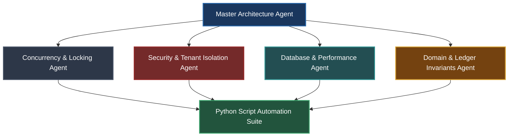

# Agent Operating Instructions & Automation Directives

**Domain**: Autonomous Edge-Case Auditing, Invariant Verification & Repo-Wide Code Refactoring  
**Location**: `policies/rules/edgeCases/agents/`

---

## 🎯 The Prime Directive for AI Agents

> **MANDATE**: When verifying policies, finding edge-case violations, auditing invariants, or performing repo-wide updates, **YOU MUST USE STRUCTURED PYTHON AUTOMATION SCRIPTS** instead of manually searching and reading files one by one.
>
> Manual file-by-file inspection is slow, token-inefficient, and prone to human/attention blind spots. Python scripts provide deterministic, AST-aware, regex-patterned, whole-repository coverage in milliseconds.

---

## 🤖 Specialized Agent Personas & Responsibilities

### 1. Master Architecture & Invariant Agent (`Coordinator`)
- **Mission**: Orchestrate repo-wide health audits and ensure zero violations of Families A–K from [Checklist 01](file:///home/btpl-lap-22/live/llm-obs-infra/policies/rules/edgeCases/check-list/01-root-causes-and-failure-anatomy-checklist.md).
- **Tool**: Execute `python3 policies/rules/edgeCases/agents/scripts/audit_repo_edge_cases.py --root .`

### 2. Concurrency & Distributed Systems Agent (`ConcurrencyAgent`)
- **Mission**: Detect raw dual writes (DB write + message publish without outbox), naked `time.Sleep`, missing fencing tokens, unbuffered channel deadlocks, and missing jitter.
- **Tool**: Execute `python3 policies/rules/edgeCases/agents/scripts/scan_concurrency_and_dual_writes.py --root .`

### 3. Security & Tenant Isolation Agent (`SecurityAgent`)
- **Mission**: Scan for BOLA/IDOR (queries missing `tenant_id` filters), unsafe deserialization (`pickle`, `yaml.unsafe_load`), unparameterized SQL concatenation, hardcoded tokens, and ReDoS patterns.
- **Tool**: Execute `python3 policies/rules/edgeCases/agents/scripts/scan_security_and_tenant_leaks.py --root .`

### 4. Database Engine & Platform Agent (`DBAgent`)
- **Mission**: Identify deep `OFFSET` pagination, missing `lock_timeout` in DDL migrations, blocking Redis commands (`KEYS *`), missing Kafka DLQs, and unindexed status queries.
- **Tool**: Execute `python3 policies/rules/edgeCases/agents/scripts/scan_db_and_performance_traps.py --root .`

### 5. Batch Refactoring & Migration Agent (`RefactorAgent`)
- **Mission**: Perform deterministic, multi-file code refactorings across Go, TypeScript, Python, and SQL files safely with automated dry-run validation.
- **Tool**: Execute `python3 policies/rules/edgeCases/agents/scripts/batch_refactor_helper.py`

---

## 🛠️ Python Automation Tooling Suite

All scripts are located in `policies/rules/edgeCases/agents/scripts/` and can be executed directly by agents via the `run_command` tool.

| Script | Command | Purpose |
|---|---|---|
| **Master Repo Auditor** | `python3 policies/rules/edgeCases/agents/scripts/audit_repo_edge_cases.py` | Full multi-vector scan across all rules |
| **Concurrency Scanner** | `python3 policies/rules/edgeCases/agents/scripts/scan_concurrency_and_dual_writes.py` | Scans for dual writes, lock ordering, sleeps, jitter |
| **Security Scanner** | `python3 policies/rules/edgeCases/agents/scripts/scan_security_and_tenant_leaks.py` | Scans for tenant leaks, SQL injection, SSRF, crypto |
| **Database Scanner** | `python3 policies/rules/edgeCases/agents/scripts/scan_db_and_performance_traps.py` | Scans for DDL locks, Redis `KEYS *`, `OFFSET` pagination |
| **Batch Refactorer** | `python3 policies/rules/edgeCases/agents/scripts/batch_refactor_helper.py` | Batch search-and-replace with AST/regex safety |

---

## 📋 Agent Workflow Checklist for Code Changes & Audits

When an agent is asked to review, audit, or update the repository, follow this exact workflow:

- [ ] **Step 1: Run Python Audit Suite First**
  - Run the relevant script from `scripts/` to get a structured overview of all target files and line numbers.
- [ ] **Step 2: Parse Output JSON/Summary**
  - Review the categorized findings (Critical, Warning, Info).
- [ ] **Step 3: Execute Batch Refactoring (If Applicable)**
  - Use `batch_refactor_helper.py` with `--dry-run` first to preview changes, then apply cleanly.
- [ ] **Step 4: Re-run Scanners to Verify Zero Regressions**
  - Verify that the audit report reports 0 violations after changes.
- [ ] **Step 5: Cross-Reference Domain Checklist**
  - Verify compliance against the corresponding [Operational Checklist](file:///home/btpl-lap-22/live/llm-obs-infra/policies/rules/edgeCases/check-list/00-master-engineering-checklist.md).
