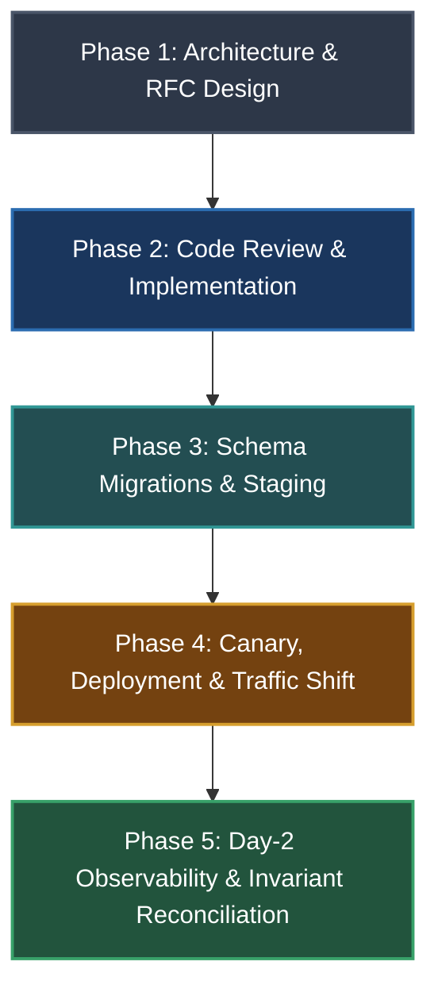

# Master Engineering Edge-Case & Invariant Checklist Index

This master index unifies the 6-volume edge cases and root-cause resilience architecture into actionable, phase-by-phase operational verification checklists.

---

## 🧭 The Checklist Suite

| Checklist | Source Volume | Target Scope |
|---|---|---|
| **[01. Root Causes & Failure Anatomy](file:///home/btpl-lap-22/live/llm-obs-infra/policies/rules/edgeCases/check-list/01-root-causes-and-failure-anatomy-checklist.md)** | [The Anatomy of a Failure](file:///home/btpl-lap-22/live/llm-obs-infra/policies/rules/edgeCases/the-anatomy-of-a-failure.md) | Families A–K, Mental Models, Invariants, Contracts, Blast Radius, Temporal Assumptions |
| **[02. Architecture, DB & Mechanisms](file:///home/btpl-lap-22/live/llm-obs-infra/policies/rules/edgeCases/check-list/02-architecture-database-and-mechanisms-checklist.md)** | [Why Failures Take Their Shape](file:///home/btpl-lap-22/live/llm-obs-infra/policies/rules/edgeCases/why-failures-take-their-shape.md) | Concurrency, DB Isolation, Outbox, State Machines, Reconciliation & Drift |
| **[03. Distributed Systems & Scale](file:///home/btpl-lap-22/live/llm-obs-infra/policies/rules/edgeCases/check-list/03-distributed-systems-and-infrastructure-checklist.md)** | [Distributed Systems Edge Cases](file:///home/btpl-lap-22/live/llm-obs-infra/policies/rules/edgeCases/distributed-systems-edge-cases.md) | Split-Brain, Fencing, Clocks, Backpressure, Cascading Retries, Leases, Anti-Patterns |
| **[04. Security & Adversarial Defense](file:///home/btpl-lap-22/live/llm-obs-infra/policies/rules/edgeCases/check-list/04-security-and-adversarial-checklist.md)** | [Security & Adversarial Edge Cases](file:///home/btpl-lap-22/live/llm-obs-infra/policies/rules/edgeCases/security-and-adversarial-edge-cases.md) | Trust Boundaries, Auth/Session, BOLA/Tenant Isolation, Secrets, Crypto, Logic Abuse |
| **[05. Engine, Platform & Runtime](file:///home/btpl-lap-22/live/llm-obs-infra/policies/rules/edgeCases/check-list/05-engine-platform-and-runtime-checklist.md)** | [Engine & Platform Edge Cases](file:///home/btpl-lap-22/live/llm-obs-infra/policies/rules/edgeCases/engine-platform-runtime-specific-edge-cases.md) | PostgreSQL, MySQL, Redis, Kafka, ES, K8s, Cloud IAM/S3, HTTP/gRPC, Language Traps |
| **[06. Domain-Specific Systems](file:///home/btpl-lap-22/live/llm-obs-infra/policies/rules/edgeCases/check-list/06-domain-specific-systems-checklist.md)** | [Domain-Specific Edge Cases](file:///home/btpl-lap-22/live/llm-obs-infra/policies/rules/edgeCases/domain-specific-edge-cases.md) | Double-Entry Ledgers, Multi-Tenant Metering, Offline Sync & CRDTs, ML/Data, Messaging |

---

## 🔄 SDLC Lifecycle Verification Matrix

Use this matrix to identify which specific checks must be executed during each phase of software delivery:

### Phase 1: Architecture & RFC Design Gate
- [ ] **Data Model & Invariants**: Enforce invariants at storage layer (unique indexes, CHECK constraints, FKs, exclusion constraints) rather than trusting application code alone ([Checklist 01 §2](file:///home/btpl-lap-22/live/llm-obs-infra/policies/rules/edgeCases/check-list/01-root-causes-and-failure-anatomy-checklist.md#2-invariants--domain-modeling-invariants-gate)).
- [ ] **Dual-Write Elimination**: Ensure state changes and emitted events use transactional outbox / CDC, never raw dual writes ([Checklist 02 §3](file:///home/btpl-lap-22/live/llm-obs-infra/policies/rules/edgeCases/check-list/02-architecture-database-and-mechanisms-checklist.md#3-transactional-boundaries--dual-writes)).
- [ ] **Idempotency & Fencing**: Every async command, webhook handler, and worker operation provides an idempotency key or fencing token ([Checklist 03 §1](file:///home/btpl-lap-22/live/llm-obs-infra/policies/rules/edgeCases/check-list/03-distributed-systems-and-infrastructure-checklist.md#1-distributed-concurrency--locking-safety)).
- [ ] **Tenant Isolation Boundary**: Object retrieval queries require composite tenant keys; authorization cannot rely solely on opaque IDs ([Checklist 04 §2](file:///home/btpl-lap-22/live/llm-obs-infra/policies/rules/edgeCases/check-list/04-security-and-adversarial-checklist.md#2-authorization--tenant-isolation-gate)).
- [ ] **Resource Bounding**: Define maximum batch sizes, maximum string lengths, rate limits, and memory ceilings ([Checklist 01 §5](file:///home/btpl-lap-22/live/llm-obs-infra/policies/rules/edgeCases/check-list/01-root-causes-and-failure-anatomy-checklist.md#5-unbounded-resources--feedback-loops-gate)).

### Phase 2: Code Review & Implementation Gate
- [ ] **TOCTOU Elimination**: Verify atomic conditional operations (`UPDATE ... WHERE version = X` or `INSERT ... ON CONFLICT`) instead of check-then-act ([Checklist 02 §1](file:///home/btpl-lap-22/live/llm-obs-infra/policies/rules/edgeCases/check-list/02-architecture-database-and-mechanisms-checklist.md#1-database-concurrency--isolation-pitfalls)).
- [ ] **Explicit Timeouts & Deadlines**: Every network call (HTTP, gRPC, DB, Redis) specifies an explicit connect and request timeout propagated through context ([Checklist 03 §4](file:///home/btpl-lap-22/live/llm-obs-infra/policies/rules/edgeCases/check-list/03-distributed-systems-and-infrastructure-checklist.md#4-cascading-failures--backpressure-defenses)).
- [ ] **Retry Budgets & Jitter**: Retries use exponential backoff with full jitter and a finite retry budget; non-idempotent endpoints are not retried automatically ([Checklist 03 §4](file:///home/btpl-lap-22/live/llm-obs-infra/policies/rules/edgeCases/check-list/03-distributed-systems-and-infrastructure-checklist.md#4-cascading-failures--backpressure-defenses)).
- [ ] **Strict Typing & Anti-Corruption**: Boundary JSON is parsed with schema validation (Zod, Protobuf, Pydantic); unit conversions (cents vs dollars, ms vs sec) use value objects ([Checklist 01 §3](file:///home/btpl-lap-22/live/llm-obs-infra/policies/rules/edgeCases/check-list/01-root-causes-and-failure-anatomy-checklist.md#3-boundary--contract-integrity-gate)).
- [ ] **Defensive Error Handling**: Catch blocks log context and trace IDs; errors are never silently swallowed or coerced to ambiguous defaults ([Checklist 01 §7](file:///home/btpl-lap-22/live/llm-obs-infra/policies/rules/edgeCases/check-list/01-root-causes-and-failure-anatomy-checklist.md#7-observability--blindness-prevention)).

### Phase 3: Schema Migrations & Staging Gate
- [ ] **Expand-Migrate-Contract**: Schema modifications (column renames, type changes, removals) use phased releases; new columns are nullable or have defaults ([Checklist 01 §8](file:///home/btpl-lap-22/live/llm-obs-infra/policies/rules/edgeCases/check-list/01-root-causes-and-failure-anatomy-checklist.md#8-change-management--evolution-safety)).
- [ ] **Lock Timeouts on Migrations**: DDL operations set `lock_timeout` to prevent blocking production query queues ([Checklist 05 §1](file:///home/btpl-lap-22/live/llm-obs-infra/policies/rules/edgeCases/check-list/05-engine-platform-and-runtime-checklist.md#1-postgresql-deep-internals)).
- [ ] **Index Creation Safety**: Postgres indexes created with `CREATE INDEX CONCURRENTLY` outside multi-statement transactions ([Checklist 05 §1](file:///home/btpl-lap-22/live/llm-obs-infra/policies/rules/edgeCases/check-list/05-engine-platform-and-runtime-checklist.md#1-postgresql-deep-internals)).
- [ ] **Rehearsal with Real Scale**: Migration tested against production-scale staging snapshot with representative volume and cardinality ([Checklist 01 §9](file:///home/btpl-lap-22/live/llm-obs-infra/policies/rules/edgeCases/check-list/01-root-causes-and-failure-anatomy-checklist.md#9-verification--testing-integrity)).

### Phase 4: Canary, Deployment & Traffic Shift Gate
- [ ] **Graceful Shutdown**: Workloads handle `SIGTERM`, stop taking new connections, finish in-flight requests within termination grace period, and cleanly release leases ([Checklist 05 §6](file:///home/btpl-lap-22/live/llm-obs-infra/policies/rules/edgeCases/check-list/05-engine-platform-and-runtime-checklist.md#6-kubernetes--container-orchestration)).
- [ ] **Canary Rollout & Blast Radius**: Release begins at 1-5% traffic with automated health metric checks comparing error rate, p99 latency, and invariant breach rate ([Checklist 01 §6](file:///home/btpl-lap-22/live/llm-obs-infra/policies/rules/edgeCases/check-list/01-root-causes-and-failure-anatomy-checklist.md#6-coupling--shared-fate-isolation)).
- [ ] **Readiness Probe Separation**: Readiness probes reflect actual backend readiness, not full deep healthchecks that trigger rolling failure cascades ([Checklist 05 §6](file:///home/btpl-lap-22/live/llm-obs-infra/policies/rules/edgeCases/check-list/05-engine-platform-and-runtime-checklist.md#6-kubernetes--container-orchestration)).

### Phase 5: Day-2 Observability & Invariant Reconciliation Gate
- [ ] **Continuous Reconcilers**: Out-of-band audit jobs run continuously to detect and alert on invariant drift (e.g. double-entry balances summing to non-zero, stuck jobs) ([Checklist 02 §5](file:///home/btpl-lap-22/live/llm-obs-infra/policies/rules/edgeCases/check-list/02-architecture-database-and-mechanisms-checklist.md#5-reconciliation--invariant-monitoring-engine)).
- [ ] **Headroom & Resource Thresholds**: Alarms trigger at 70% threshold for DB connections, disk inodes, Redis memory, Kafka consumer lag, and table integer sequence limits ([Checklist 01 §5](file:///home/btpl-lap-22/live/llm-obs-infra/policies/rules/edgeCases/check-list/01-root-causes-and-failure-anatomy-checklist.md#5-unbounded-resources--feedback-loops-gate)).
- [ ] **Dead-Letter Queue (DLQ) Monitoring**: Automated alarms fire on DLQ message count > 0 with runbooks for replay and poison-pill remediation ([Checklist 05 §4](file:///home/btpl-lap-22/live/llm-obs-infra/policies/rules/edgeCases/check-list/05-engine-platform-and-runtime-checklist.md#4-kafka--message-brokers)).
