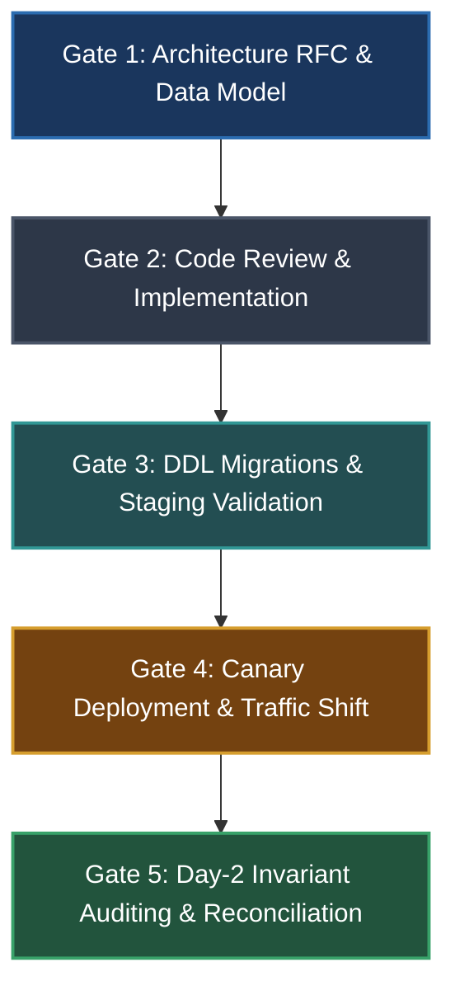

# Master Engineering Edge-Case & Invariant Checklist Index

**Unified SDLC Verification Matrix, Architecture Review Gates & Cross-Domain Operational Runbooks**

---

## 🧭 The Checklist Suite Directory

| Checklist Document | Source Volume | Target Scope & Key Subsystems |
|---|---|---|
| **[01. Root Causes & Failure Anatomy](file:///home/btpl-lap-22/live/llm-obs-infra/policies/rules/edgeCases/check-list/01-root-causes-and-failure-anatomy-checklist.md)** | [The Anatomy of a Failure (Parts 1–8)](file:///home/btpl-lap-22/live/llm-obs-infra/policies/rules/edgeCases/the-anatomy-of-a-failure.md) | • 6-Layer Incident Analysis • Families A–K (Assumptions, Models, Invariants, Contracts, Resources, Blast Radius, Blindness, Evolution) • Symptom-to-Cause Diagnostics & 15 Core Principles |
| **[02. Architecture, DB & Mechanisms](file:///home/btpl-lap-22/live/llm-obs-infra/policies/rules/edgeCases/check-list/02-architecture-database-and-mechanisms-checklist.md)** | [Why Failures Take Their Shape (Parts 9–17)](file:///home/btpl-lap-22/live/llm-obs-infra/policies/rules/edgeCases/why-failures-take-their-shape.md) | • DB Isolation Levels (Read Committed, Repeatable Read, Serializable) • Concurrency Control (OCC, `SKIP LOCKED`, Hot-spot event logs) • Keyset Pagination, Replication Lag & Primary Routing • Transactional Outbox, CDC, State Machines & Invariant Reconcilers |
| **[03. Distributed Systems & Scale](file:///home/btpl-lap-22/live/llm-obs-infra/policies/rules/edgeCases/check-list/03-distributed-systems-and-infrastructure-checklist.md)** | [Distributed Systems Edge Cases (Parts 18–28)](file:///home/btpl-lap-22/live/llm-obs-infra/policies/rules/edgeCases/distributed-systems-edge-cases.md) | • Distributed Locking with Fencing Tokens • Quorums, Raft Consensus & Monotonic Timers • Distributed Sagas (Compensatable, Pivot, Retryable) • TCP Keepalives, Jittered Backoff, Circuit Breakers & Chaos Testing |
| **[04. Security & Adversarial Defense](file:///home/btpl-lap-22/live/llm-obs-infra/policies/rules/edgeCases/check-list/04-security-and-adversarial-checklist.md)** | [Security & Adversarial Edge Cases (Parts 29–43)](file:///home/btpl-lap-22/live/llm-obs-infra/policies/rules/edgeCases/security-and-adversarial-edge-cases.md) | • Trust Boundaries & Zero Trust Network Interceptors • Authn/Session (Argon2id, Refresh Token Family Rotation, JWT Denylists) • Authorization (BOLA/IDOR Elimination, Postgres RLS, State Auth) • Envelope Encryption, 100% Parameterization, SSRF, ReDoS & Audit Trails |
| **[05. Engine, Platform & Runtime](file:///home/btpl-lap-22/live/llm-obs-infra/policies/rules/edgeCases/check-list/05-engine-platform-and-runtime-checklist.md)** | [Engine & Platform Edge Cases (Parts 44–58)](file:///home/btpl-lap-22/live/llm-obs-infra/policies/rules/edgeCases/engine-platform-runtime-specific-edge-cases.md) | • PostgreSQL (`datfrozenxid` wraparound, `lock_timeout`, `CONCURRENTLY`) • MySQL Gap Locks, Redis $O(N)$ Command Elimination, Kafka Rebalances & DLQs • Elasticsearch Mapping Explosions, K8s Graceful Shutdown (`preStop` + `SIGTERM`) • Runtime Traps (Go Goroutines, Node Event Loop, Python GIL, JVM GC STW) |
| **[06. Domain-Specific Systems](file:///home/btpl-lap-22/live/llm-obs-infra/policies/rules/edgeCases/check-list/06-domain-specific-systems-checklist.md)** | [Domain-Specific Edge Cases (Parts 59–68)](file:///home/btpl-lap-22/live/llm-obs-infra/policies/rules/edgeCases/domain-specific-edge-cases.md) | • Double-Entry Ledgers ($\sum \text{Debits} - \sum \text{Credits} = 0$, Banker's Rounding) • Multi-Tenant SaaS Usage Metering, Proration & Quota Decrements • Mobile Offline Sync, CRDTs, Tombstone Retention & Client Clock Invalidation • ML Feature Store Drift, Streaming Watermarks & Messaging Quiet Hours |

---

## 🔄 SDLC Lifecycle Verification Matrix & Gates

### Gate 1: Architecture RFC & Data Model Review
- [ ] **Authoritative Storage Invariants**: Every business rule is backed by database constraints (`CHECK`, `UNIQUE`, `FOREIGN KEY`, `EXCLUSION`), not just UI/code checks ([Checklist 01 §4](file:///home/btpl-lap-22/live/llm-obs-infra/policies/rules/edgeCases/check-list/01-root-causes-and-failure-anatomy-checklist.md#4-family-c-invariants--ownership-enforcement-part-2c)).
- [ ] **Dual-Write Elimination Architecture**: All state changes emitting events use the Transactional Outbox pattern or CDC, with zero split dual writes ([Checklist 02 §6](file:///home/btpl-lap-22/live/llm-obs-infra/policies/rules/edgeCases/check-list/02-architecture-database-and-mechanisms-checklist.md#6-transactional-boundaries--dual-write-elimination-part-9-part-15)).
- [ ] **Distributed Fencing Tokens**: All distributed locks and asynchronous workers enforce fencing tokens (`WHERE last_fencing_token < :token`) ([Checklist 03 §1](file:///home/btpl-lap-22/live/llm-obs-infra/policies/rules/edgeCases/check-list/03-distributed-systems-and-infrastructure-checklist.md#1-distributed-locking--fencing-tokens-part-181)).
- [ ] **Tenant Isolation Design**: Composite tenant queries and database Row-Level Security (RLS) are designed into all multi-tenant entity schemas ([Checklist 04 §3](file:///home/btpl-lap-22/live/llm-obs-infra/policies/rules/edgeCases/check-list/04-security-and-adversarial-checklist.md#3-authorization-depth--tenant-isolation-part-31)).
- [ ] **Finite Resource Bounds**: Maximum batch sizes, payload limits, queue lengths, string lengths, and query result limits are explicitly specified ([Checklist 01 §7](file:///home/btpl-lap-22/live/llm-obs-infra/policies/rules/edgeCases/check-list/01-root-causes-and-failure-anatomy-checklist.md#7-family-f-resource-bounding--feedback-loops-part-2f)).

### Gate 2: Code Review & Implementation Verification
- [ ] **Atomic Conditional Updates**: Read-then-write code is converted to atomic conditional operations (`UPDATE ... WHERE version = :v`) ([Checklist 02 §1](file:///home/btpl-lap-22/live/llm-obs-infra/policies/rules/edgeCases/check-list/02-architecture-database-and-mechanisms-checklist.md#1-database-isolation-levels--anomaly-elimination-parts-9-101)).
- [ ] **Explicit Deadline & Timeout Budgets**: All network calls (HTTP, gRPC, DB, Redis) specify explicit connect/request timeouts propagated through context ([Checklist 03 §4](file:///home/btpl-lap-22/live/llm-obs-infra/policies/rules/edgeCases/check-list/03-distributed-systems-and-infrastructure-checklist.md#4-network-partitions--connection-lifecycles-part-185)).
- [ ] **Full Jitter Exponential Backoff**: Retries use exponential backoff with full randomized jitter and a finite retry budget ([Checklist 03 §4](file:///home/btpl-lap-22/live/llm-obs-infra/policies/rules/edgeCases/check-list/03-distributed-systems-and-infrastructure-checklist.md#4-network-partitions--connection-lifecycles-part-185)).
- [ ] **Strict Boundary Parsing**: External inputs are validated into domain types via schema validators (Zod/Pydantic/Protobuf) ([Checklist 01 §5](file:///home/btpl-lap-22/live/llm-obs-infra/policies/rules/edgeCases/check-list/01-root-causes-and-failure-anatomy-checklist.md#5-family-d-boundary--contract-robustness-part-2d)).
- [ ] **Keyset Pagination**: Deep `OFFSET` is banned; pagination uses tuple comparison (`WHERE (created_at, id) < (...)`) ([Checklist 02 §3](file:///home/btpl-lap-22/live/llm-obs-infra/policies/rules/edgeCases/check-list/02-architecture-database-and-mechanisms-checklist.md#3-high-performance-pagination--keyset-navigation-part-104)).
- [ ] **Zero Swallowed Errors**: Catch blocks log structured context and trace IDs, never returning silent empty arrays on error ([Checklist 01 §9](file:///home/btpl-lap-22/live/llm-obs-infra/policies/rules/edgeCases/check-list/01-root-causes-and-failure-anatomy-checklist.md#9-family-h-observability--blindness-elimination-part-2h)).

### Gate 3: DDL Migrations & Staging Gate
- [ ] **Expand-Migrate-Contract Execution**: Schema modifications follow phased non-breaking rollouts ([Checklist 01 §10](file:///home/btpl-lap-22/live/llm-obs-infra/policies/rules/edgeCases/check-list/01-root-causes-and-failure-anatomy-checklist.md#10-family-i-change--evolution-discipline-part-2i)).
- [ ] **DDL Lock Timeouts**: All migrations execute `SET lock_timeout = '2s';` before modifying tables ([Checklist 05 §1](file:///home/btpl-lap-22/live/llm-obs-infra/policies/rules/edgeCases/check-list/05-engine-platform-and-runtime-checklist.md#1-postgresql-internals--storage-engine-gate-part-45)).
- [ ] **Concurrent Index Creation**: PostgreSQL indexes are created using `CREATE INDEX CONCURRENTLY` in non-transactional mode ([Checklist 05 §1](file:///home/btpl-lap-22/live/llm-obs-infra/policies/rules/edgeCases/check-list/05-engine-platform-and-runtime-checklist.md#1-postgresql-internals--storage-engine-gate-part-45)).
- [ ] **Staging Scale Rehearsal**: Migration and queries are verified against production-scale datasets with realistic index cardinality ([Checklist 01 §11](file:///home/btpl-lap-22/live/llm-obs-infra/policies/rules/edgeCases/check-list/01-root-causes-and-failure-anatomy-checklist.md#11-family-j--k-verification--organizational-rigor-parts-2j-2k-4-7--8)).

### Gate 4: Canary Deployment & Traffic Shift Gate
- [ ] **Graceful Shutdown & PreStop Hooks**: Pods execute `preStop: sleep 5` and finish in-flight requests on `SIGTERM` within grace period ([Checklist 05 §6](file:///home/btpl-lap-22/live/llm-obs-infra/policies/rules/edgeCases/check-list/05-engine-platform-and-runtime-checklist.md#6-kubernetes--container-orchestration-part-50)).
- [ ] **Canary Rollout Metrics**: Traffic is shifted in staged rings (1% $\to$ 10% $\to$ 100%) with automated rollbacks on p99 latency or error spikes ([Checklist 01 §8](file:///home/btpl-lap-22/live/llm-obs-infra/policies/rules/edgeCases/check-list/01-root-causes-and-failure-anatomy-checklist.md#8-family-g-coupling--shared-fate-elimination-part-2g)).
- [ ] **Liveness vs. Readiness Decoupling**: Liveness probes only test process health; readiness probes test traffic reception capacity ([Checklist 05 §6](file:///home/btpl-lap-22/live/llm-obs-infra/policies/rules/edgeCases/check-list/05-engine-platform-and-runtime-checklist.md#6-kubernetes--container-orchestration-part-50)).

### Gate 5: Day-2 Invariant Auditing & Reconciliation Gate
- [ ] **Continuous Invariant Reconciliation Crons**: Out-of-band audit jobs run continuously to detect and repair data drift across systems ([Checklist 02 §9](file:///home/btpl-lap-22/live/llm-obs-infra/policies/rules/edgeCases/check-list/02-architecture-database-and-mechanisms-checklist.md#9-continuous-invariant-reconciliation--drift-auditing-part-14-part-16)).
- [ ] **Resource Headroom Alarms**: Alarms fire at 70% threshold for DB connections, `datfrozenxid` age, Kafka lag, and disk space ([Checklist 01 §7](file:///home/btpl-lap-22/live/llm-obs-infra/policies/rules/edgeCases/check-list/01-root-causes-and-failure-anatomy-checklist.md#7-family-f-resource-bounding--feedback-loops-part-2f)).
- [ ] **DLQ & Poison Pill Monitoring**: Alarms fire immediately on DLQ count $> 0$ with automated poison pill replay runbooks ([Checklist 05 §4](file:///home/btpl-lap-22/live/llm-obs-infra/policies/rules/edgeCases/check-list/05-engine-platform-and-runtime-checklist.md#4-kafka--message-broker-infrastructure-part-48)).
